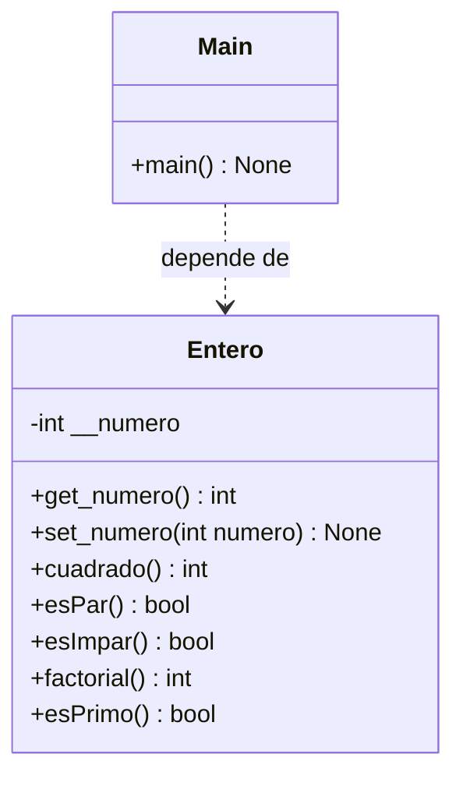

```mermaid
classDiagram

class Entero {
    -int __numero
    +get_numero() int
    +set_numero(int numero) None
    +cuadrado() int
    +esPar() bool
    +esImpar() bool
    +factorial() int
    +esPrimo() bool
}

class Main {
    +main() None
}

Main ..> Entero : depende de
```