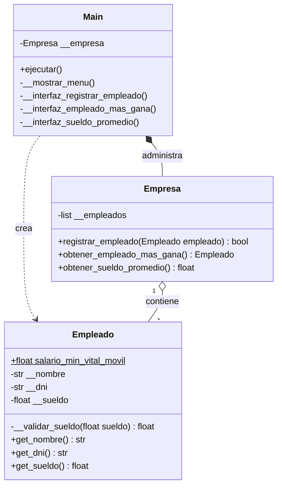

```mermaid
classDiagram

class Main {
    -Empresa __empresa
    +ejecutar()
    -__mostrar_menu()
    -__interfaz_registrar_empleado()
    -__interfaz_empleado_mas_gana()
    -__interfaz_sueldo_promedio()
}

class Empresa {
    -list __empleados
    +registrar_empleado(Empleado empleado) bool
    +obtener_empleado_mas_gana() Empleado
    +obtener_sueldo_promedio() float
}

class Empleado {
    +float salario_min_vital_movil$
    -str __nombre
    -str __dni
    -float __sueldo
    -__validar_sueldo(float sueldo) float
    +get_nombre() str
    +get_dni() str
    +get_sueldo() float
}

Main *-- Empresa : administra
Main ..> Empleado : crea
Empresa "1" o-- "*" Empleado : contiene
```
