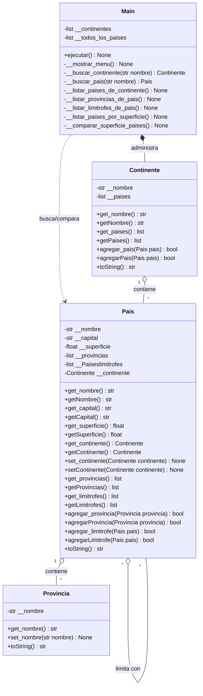

```mermaid
classDiagram

class Main {
    -list __continentes
    -list __todos_los_paises
    +ejecutar() None
    -__mostrar_menu() None
    -__buscar_continente(str nombre) Continente
    -__buscar_pais(str nombre) Pais
    -__listar_paises_de_continente() None
    -__listar_provincias_de_pais() None
    -__listar_limitrofes_de_pais() None
    -__listar_paises_por_superficie() None
    -__comparar_superficie_paises() None
}

class Continente {
    -str __nombre
    -list __paises
    +get_nombre() str
    +getNombre() str
    +get_paises() list
    +getPaises() list
    +agregar_pais(Pais pais) bool
    +agregarPais(Pais pais) bool
    +toString() str
}

class Pais {
    -str __nombre
    -str __capital
    -float __superficie
    -list __provincias
    -list __Paiseslimitrofes
    -Continente __continente
    +get_nombre() str
    +getNombre() str
    +get_capital() str
    +getCapital() str
    +get_superficie() float
    +getSuperficie() float
    +get_continente() Continente
    +getContinente() Continente
    +set_continente(Continente continente) None
    +setContinente(Continente continente) None
    +get_provincias() list
    +getProvincias() list
    +get_limitrofes() list
    +getLimitrofes() list
    +agregar_provincia(Provincia provincia) bool
    +agregarProvincia(Provincia provincia) bool
    +agregar_limitrofe(Pais pais) bool
    +agregarLimitrofe(Pais pais) bool
    +toString() str
}

class Provincia {
    -str __nombre
    +get_nombre() str
    +set_nombre(str nombre) None
    +toString() str
}

Main *-- Continente : administra
Main ..> Pais : busca/compara
Continente "1" o-- "*" Pais : contiene
Pais "1" o-- "*" Provincia : contiene
Pais "*" o-- "*" Pais : limita con
```
