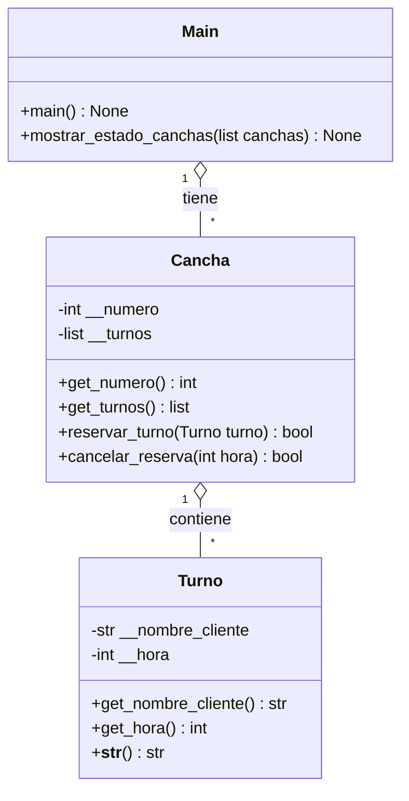

```mermaid
classDiagram

class Main {
    +main() None
    +mostrar_estado_canchas(list canchas) None
}

class Cancha {
    -int __numero
    -list __turnos
    +get_numero() int
    +get_turnos() list
    +reservar_turno(Turno turno) bool
    +cancelar_reserva(int hora) bool
}

class Turno {
    -str __nombre_cliente
    -int __hora
    +get_nombre_cliente() str
    +get_hora() int
    +__str__() str
}

Main "1" o-- "*" Cancha : tiene   
Cancha "1" o-- "*" Turno : contiene
```
