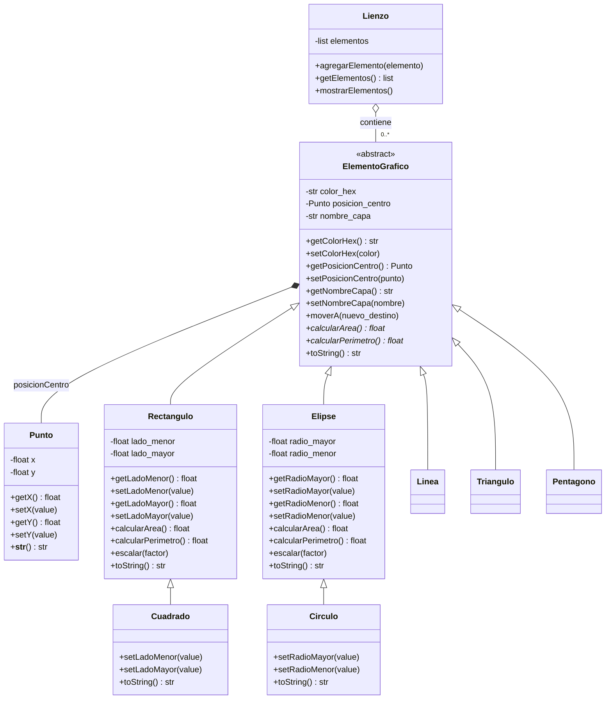

```mermaid
classDiagram

class Punto {
    -float x
    -float y
    +getX() float
    +setX(value)
    +getY() float
    +setY(value)
    +__str__() str
}

class ElementoGrafico {
    <<abstract>>
    -str color_hex
    -Punto posicion_centro
    -str nombre_capa
    +getColorHex() str
    +setColorHex(color)
    +getPosicionCentro() Punto
    +setPosicionCentro(punto)
    +getNombreCapa() str
    +setNombreCapa(nombre)
    +moverA(nuevo_destino)
    +calcularArea()* float
    +calcularPerimetro()* float
    +toString() str
}

class Rectangulo {
    -float lado_menor
    -float lado_mayor
    +getLadoMenor() float
    +setLadoMenor(value)
    +getLadoMayor() float
    +setLadoMayor(value)
    +calcularArea() float
    +calcularPerimetro() float
    +escalar(factor)
    +toString() str
}

class Cuadrado {
    +setLadoMenor(value)
    +setLadoMayor(value)
    +toString() str
}

class Elipse {
    -float radio_mayor
    -float radio_menor
    +getRadioMayor() float
    +setRadioMayor(value)
    +getRadioMenor() float
    +setRadioMenor(value)
    +calcularArea() float
    +calcularPerimetro() float
    +escalar(factor)
    +toString() str
}

class Circulo {
    +setRadioMayor(value)
    +setRadioMenor(value)
    +toString() str
}

class Lienzo {
    -list elementos
    +agregarElemento(elemento)
    +getElementos() list
    +mostrarElementos()
}

class Linea
class Triangulo
class Pentagono

ElementoGrafico <|-- Rectangulo
Rectangulo <|-- Cuadrado

ElementoGrafico <|-- Elipse
Elipse <|-- Circulo

ElementoGrafico <|-- Linea
ElementoGrafico <|-- Triangulo
ElementoGrafico <|-- Pentagono

ElementoGrafico *-- Punto : posicionCentro
Lienzo o-- "0..*" ElementoGrafico : contiene
```
