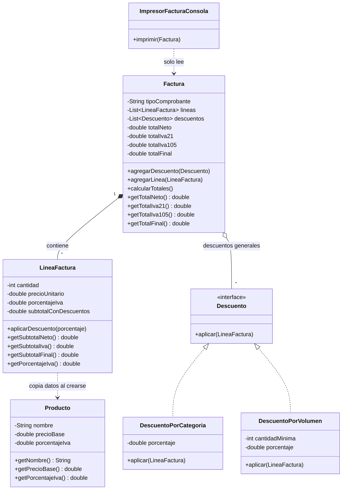

```mermaid
classDiagram
class Producto {
  -String nombre
  -double precioBase
  -double porcentajeIva
  +getNombre() String
  +getPrecioBase() double
  +getPorcentajeIva() double
}

class LineaFactura {
  -int cantidad
  -double precioUnitario
  -double porcentajeIva
  -double subtotalConDescuentos
  +aplicarDescuento(porcentaje)
  +getSubtotalNeto() double
  +getSubtotalIva() double
  +getSubtotalFinal() double
  +getPorcentajeIva() double
}

class Factura {
  -String tipoComprobante
  -List~LineaFactura~ lineas
  -List~Descuento~ descuentos
  -double totalNeto
  -double totalIva21
  -double totalIva105
  -double totalFinal
  +agregarDescuento(Descuento)
  +agregarLinea(LineaFactura)
  +calcularTotales()
  +getTotalNeto() double
  +getTotalIva21() double
  +getTotalIva105() double
  +getTotalFinal() double
}

class Descuento {
  <<interface>>
  +aplicar(LineaFactura)
}

class DescuentoPorCategoria {
  -double porcentaje
  +aplicar(LineaFactura)
}

class DescuentoPorVolumen {
  -int cantidadMinima
  -double porcentaje
  +aplicar(LineaFactura)
}

class ImpresorFacturaConsola {
  +imprimir(Factura)
}

Factura "1" *-- "*" LineaFactura : contiene
LineaFactura ..> Producto : copia datos al crearse
Factura o-- "*" Descuento : descuentos generales
Descuento <|.. DescuentoPorCategoria
Descuento <|.. DescuentoPorVolumen
ImpresorFacturaConsola ..> Factura : solo lee
```
