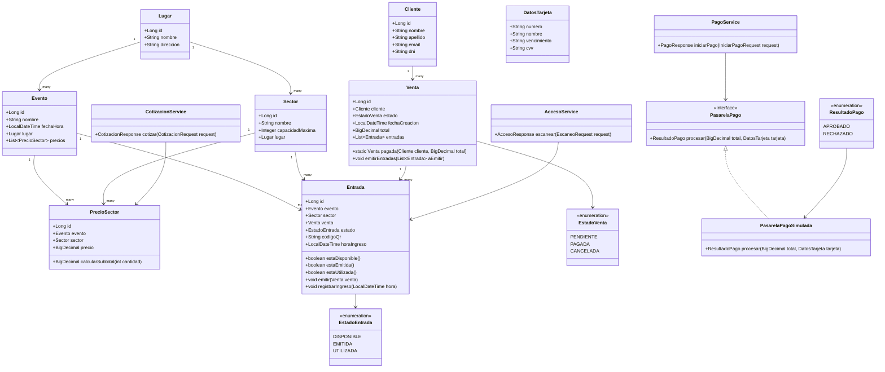

```mermaid
classDiagram
    class Lugar {
        +Long id
        +String nombre
        +String direccion
    }

    class Sector {
        +Long id
        +String nombre
        +Integer capacidadMaxima
        +Lugar lugar
    }

    class Evento {
        +Long id
        +String nombre
        +LocalDateTime fechaHora
        +Lugar lugar
        +List~PrecioSector~ precios
    }

    class PrecioSector {
        +Long id
        +Evento evento
        +Sector sector
        +BigDecimal precio
        +BigDecimal calcularSubtotal(int cantidad)
    }

    class Cliente {
        +Long id
        +String nombre
        +String apellido
        +String email
        +String dni
    }

    class EstadoEntrada {
        <<enumeration>>
        DISPONIBLE
        EMITIDA
        UTILIZADA
    }

    class Entrada {
        +Long id
        +Evento evento
        +Sector sector
        +Venta venta
        +EstadoEntrada estado
        +String codigoQr
        +LocalDateTime horaIngreso
        +boolean estaDisponible()
        +boolean estaEmitida()
        +boolean estaUtilizada()
        +void emitir(Venta venta)
        +void registrarIngreso(LocalDateTime hora)
    }

    class EstadoVenta {
        <<enumeration>>
        PENDIENTE
        PAGADA
        CANCELADA
    }

    class Venta {
        +Long id
        +Cliente cliente
        +EstadoVenta estado
        +LocalDateTime fechaCreacion
        +BigDecimal total
        +List~Entrada~ entradas
        +static Venta pagada(Cliente cliente, BigDecimal total)
        +void emitirEntradas(List~Entrada~ aEmitir)
    }

    class DatosTarjeta {
        +String numero
        +String nombre
        +String vencimiento
        +String cvv
    }

    class ResultadoPago {
        <<enumeration>>
        APROBADO
        RECHAZADO
    }

    class PasarelaPago {
        <<interface>>
        +ResultadoPago procesar(BigDecimal total, DatosTarjeta tarjeta)
    }

    class PasarelaPagoSimulada {
        +ResultadoPago procesar(BigDecimal total, DatosTarjeta tarjeta)
    }

    class CotizacionService {
        +CotizacionResponse cotizar(CotizacionRequest request)
    }

    class PagoService {
        +PagoResponse iniciarPago(IniciarPagoRequest request)
    }

    class AccesoService {
        +AccesoResponse escanear(EscaneoRequest request)
    }

    Lugar "1" --> "many" Sector
    Lugar "1" --> "many" Evento

    Evento "1" --> "many" PrecioSector
    Sector "1" --> "many" PrecioSector

    Evento "1" --> "many" Entrada
    Sector "1" --> "many" Entrada

    Cliente "1" --> "many" Venta
    Venta "1" --> "many" Entrada

    Entrada --> EstadoEntrada
    Venta --> EstadoVenta

    PasarelaPago <|.. PasarelaPagoSimulada
    ResultadoPago --> PasarelaPagoSimulada

    CotizacionService --> PrecioSector
    PagoService --> PasarelaPago
    AccesoService --> Entrada
```
