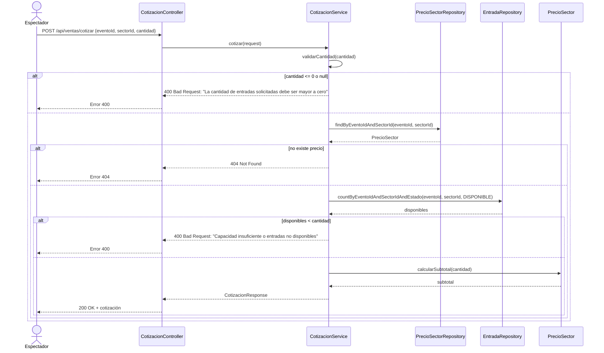

```mermaid
sequenceDiagram
    actor Espectador
    participant Controller as CotizacionController
    participant Service as CotizacionService
    participant RepoPrecio as PrecioSectorRepository
    participant RepoEntrada as EntradaRepository
    participant Precio as PrecioSector

    Espectador->>Controller: POST /api/ventas/cotizar {eventoId, sectorId, cantidad}
    Controller->>Service: cotizar(request)

    Service->>Service: validarCantidad(cantidad)

    alt cantidad <= 0 o null
        Service-->>Controller: 400 Bad Request: "La cantidad de entradas solicitadas debe ser mayor a cero"
        Controller-->>Espectador: Error 400
    else
        Service->>RepoPrecio: findByEventoIdAndSectorId(eventoId, sectorId)
        RepoPrecio-->>Service: PrecioSector

        alt no existe precio
            Service-->>Controller: 404 Not Found
            Controller-->>Espectador: Error 404
        else
            Service->>RepoEntrada: countByEventoIdAndSectorIdAndEstado(eventoId, sectorId, DISPONIBLE)
            RepoEntrada-->>Service: disponibles

            alt disponibles < cantidad
                Service-->>Controller: 400 Bad Request: "Capacidad insuficiente o entradas no disponibles"
                Controller-->>Espectador: Error 400
            else
                Service->>Precio: calcularSubtotal(cantidad)
                Precio-->>Service: subtotal
                Service-->>Controller: CotizacionResponse
                Controller-->>Espectador: 200 OK + cotización
            end
        end
    end
```
