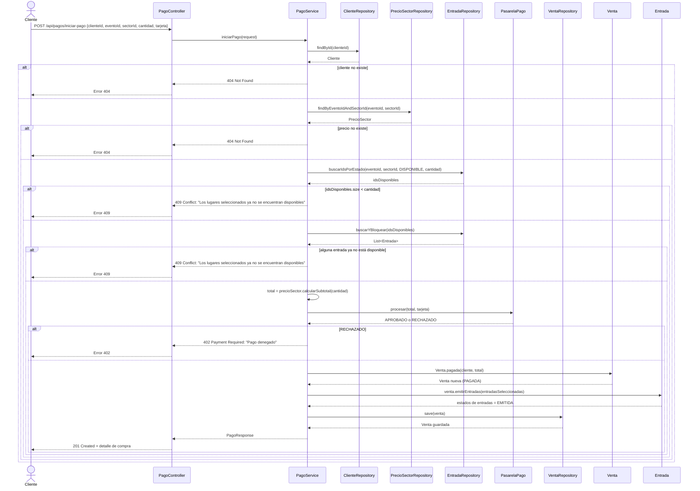

```mermaid
sequenceDiagram
    actor Cliente
    participant Controller as PagoController
    participant Service as PagoService
    participant RepoCliente as ClienteRepository
    participant RepoPrecio as PrecioSectorRepository
    participant RepoEntrada as EntradaRepository
    participant Pasarela as PasarelaPago
    participant VentaRepo as VentaRepository
    participant VentaObj as Venta
    participant EntradaObj as Entrada

    Cliente->>Controller: POST /api/pagos/iniciar-pago {clienteId, eventoId, sectorId, cantidad, tarjeta}
    Controller->>Service: iniciarPago(request)

    Service->>RepoCliente: findById(clienteId)
    RepoCliente-->>Service: Cliente

    alt cliente no existe
        Service-->>Controller: 404 Not Found
        Controller-->>Cliente: Error 404
    else
        Service->>RepoPrecio: findByEventoIdAndSectorId(eventoId, sectorId)
        RepoPrecio-->>Service: PrecioSector

        alt precio no existe
            Service-->>Controller: 404 Not Found
            Controller-->>Cliente: Error 404
        else
            Service->>RepoEntrada: buscarIdsPorEstado(eventoId, sectorId, DISPONIBLE, cantidad)
            RepoEntrada-->>Service: idsDisponibles

            alt idsDisponibles.size < cantidad
                Service-->>Controller: 409 Conflict: "Los lugares seleccionados ya no se encuentran disponibles"
                Controller-->>Cliente: Error 409
            else
                Service->>RepoEntrada: buscarYBloquear(idsDisponibles)
                RepoEntrada-->>Service: List<Entrada>

                alt alguna entrada ya no está disponible
                    Service-->>Controller: 409 Conflict: "Los lugares seleccionados ya no se encuentran disponibles"
                    Controller-->>Cliente: Error 409
                else
                    Service->>Service: total = precioSector.calcularSubtotal(cantidad)
                    Service->>Pasarela: procesar(total, tarjeta)
                    Pasarela-->>Service: APROBADO o RECHAZADO

                    alt RECHAZADO
                        Service-->>Controller: 402 Payment Required: "Pago denegado"
                        Controller-->>Cliente: Error 402
                    else
                        Service->>VentaObj: Venta.pagada(cliente, total)
                        VentaObj-->>Service: Venta nueva (PAGADA)

                        Service->>EntradaObj: venta.emitirEntradas(entradasSeleccionadas)
                        EntradaObj-->>Service: estados de entradas = EMITIDA

                        Service->>VentaRepo: save(venta)
                        VentaRepo-->>Service: Venta guardada

                        Service-->>Controller: PagoResponse
                        Controller-->>Cliente: 201 Created + detalle de compra
                    end
                end
            end
        end
    end
```
