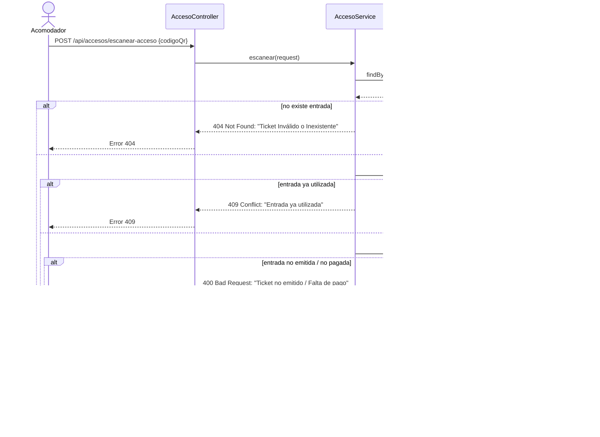

```mermaid
sequenceDiagram
    actor Acomodador
    participant Controller as AccesoController
    participant Service as AccesoService
    participant RepoEntrada as EntradaRepository
    participant EntradaObj as Entrada

    Acomodador->>Controller: POST /api/accesos/escanear-acceso {codigoQr}
    Controller->>Service: escanear(request)

    Service->>RepoEntrada: findByCodigoQr(codigoQr.trim())
    RepoEntrada-->>Service: Entrada o null

    alt no existe entrada
        Service-->>Controller: 404 Not Found: "Ticket Inválido o Inexistente"
        Controller-->>Acomodador: Error 404
    else
        Service->>EntradaObj: estaUtilizada()

        alt entrada ya utilizada
            Service-->>Controller: 409 Conflict: "Entrada ya utilizada"
            Controller-->>Acomodador: Error 409
        else
            Service->>EntradaObj: estaEmitida()

            alt entrada no emitida / no pagada
                Service-->>Controller: 400 Bad Request: "Ticket no emitido / Falta de pago"
                Controller-->>Acomodador: Error 400
            else
                Service->>EntradaObj: registrarIngreso(LocalDateTime.now(clock))
                EntradaObj-->>Service: estado = UTILIZADA, horaIngreso = ahora
                Service-->>Controller: AccesoResponse {status="Acceso Permitido"}
                Controller-->>Acomodador: 200 OK + acceso permitido
            end
        end
    end
```
